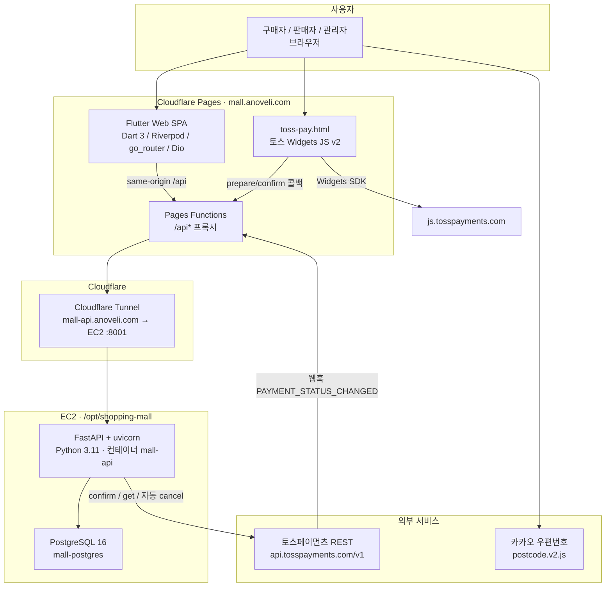
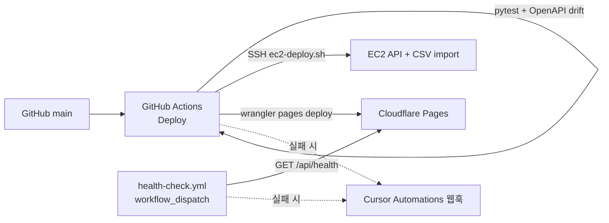
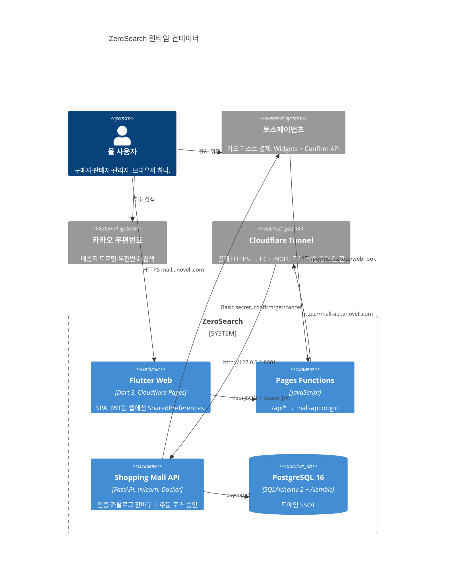

# 현재 기술·시스템 아키텍처

조사 기준: 루트 `README.md`, `docs/README.md`, `deploy/README.md`, 매니페스트(`package.json`, `apps/api/requirements.txt`, `apps/flutter/pubspec.yaml`), Compose/Dockerfile, GitHub Actions, 실제 import·배포 설정. **계획만 있고 런타임에 없는 것은 다이어그램에 넣지 않고** 「계획/미사용」에 적는다.

데이터 테이블 관계는 별도 (`docs/architecture-erd.md`). 이 문서는 클라이언트 → API → DB → 외부 서비스의 **런타임 기술**만 다룬다.

저장소: pnpm 워크스페이스 + FastAPI + Flutter 웹. 운영 호스트는 `mall.anoveli.com` 하나(구매자 `/`, 판매자 `/seller`, 관리자 `/admin`).

---

## Mermaid — 시스템 구성 (발표용)

브라우저 요청이 화면·API·DB·외부 PG로 가는 경로. 복사해서 GitHub·Notion·슬라이드 Mermaid에 붙이면 된다.

운영 배포·알림(사용자 트래픽이 아님):

---

## C4 Container (동일 범위)

---

## 계층별 기술

역할은 **현재 코드가 하는 일** 한 줄. 버전은 매니페스트·이미지 태그 기준.

### 클라이언트

| 기술 | 역할 | 근거 |
|------|------|------|
| Flutter (SDK `^3.12`, `flutter` stable CI) | 구매자·판매자·관리자 UI. 운영 빌드는 **웹만**. | `apps/flutter/pubspec.yaml`, `.github/workflows/deploy.yml` |
| Dart 3 | 앱 언어. | `pubspec.yaml` `environment.sdk` |
| Material (`uses-material-design`) | 기본 위젯·아이콘. | `pubspec.yaml` |
| flutter_riverpod `^2.6` | 화면 상태. | `pubspec.yaml` |
| go_router `^14.8` | path 라우팅 (`/`, `/seller`, `/admin`, `/checkout`, `/toss-pay` …). | `pubspec.yaml`, `lib/core/routing/app_router.dart` |
| Dio `^5.8` | HTTP. JWT Bearer 인터셉터. | `lib/core/network/api_client.dart` |
| shopping_mall_api (path, OpenAPI dart-dio) | 생성 클라이언트. 수기 `ApiClient`가 감싼다. | `pubspec.yaml`, `lib/api/` |
| built_value / built_collection | 생성 모델 직렬화. | `pubspec.yaml` |
| shared_preferences | 웹 JWT·테마. 웹은 secure storage 대신 이쪽. | `token_storage.dart`, `prefs_service.dart` |
| flutter_secure_storage | 비웹(앱) JWT. **운영 배포는 웹**. | `token_storage.dart` |
| file_picker | 관리자 CSV 비상 업로드. | `admin_screen.dart` |
| `web` / `dart.library.js_interop` | 토스 창·다음 주소 브리지. | `toss_payment_bridge_web.dart`, `daum_postcode_bridge_web.dart` |
| 토스페이먼츠 JS `v2/standard` | `toss-pay.html` 주문서형 위젯. | `apps/flutter/web/toss-pay.html` |
| 카카오(다음) 우편번호 `postcode.v2.js` | 배송지 검색. | `apps/flutter/web/index.html` |

Android/iOS/desktop 폴더는 Flutter 기본 러너만 있고, CI·토스 브리지는 웹만 탄다.

### API / 백엔드

| 기술 | 역할 | 근거 |
|------|------|------|
| Python 3.11 | API 런타임. | `apps/api/Dockerfile`, CI `setup-python` |
| FastAPI `>=0.115` | HTTP API, OpenAPI `/docs`. | `requirements.txt`, `apps/api/main.py` |
| uvicorn `[standard]` | ASGI. 로컬 `--reload` :8001, 프로덕션 컨테이너 :8000. | `requirements.txt`, `scripts/dev.mjs`, Dockerfile `CMD` |
| Pydantic / pydantic-settings | 요청·응답 스키마, `.env` 설정. | `requirements.txt`, `app/config.py`, `app/schemas/` |
| SQLAlchemy 2 | ORM, 커넥션 풀. | `requirements.txt`, `app/database.py` |
| Alembic | 마이그레이션 `001`–`010`. 컨테이너 기동 시 `upgrade head`. | `apps/api/alembic/`, Dockerfile |
| psycopg 3 (`postgresql+psycopg`) | Postgres 드라이버. | `requirements.txt`, `DATABASE_URL` |
| python-jose + cryptography | JWT HS256 발급·검증. 세션 테이블 없음. | `app/deps.py` |
| bcrypt | 비밀번호 해시. | `app/deps.py` |
| httpx | 토스 REST, (선택) DummyJSON fetch. | `app/services/toss_payments.py`, `scripts/import_dummyjson_catalog.py` |
| python-multipart / email-validator | 파일 업로드·이메일 검증. | `requirements.txt` |
| CORSMiddleware | 직접 origin 호출용. 브라우저는 same-origin `/api`가 기본. | `main.py`, `CORS_ORIGINS` |

레이어: `routers/` → `services/` → `models/` + `schemas/`. 워커·gunicorn 멀티프로세스·큐는 없음 (`docs/load-baseline.md`도 미구현으로 적음).

### DB / 캐시 / 큐

| 기술 | 역할 | 근거 |
|------|------|------|
| PostgreSQL 16 | 유일한 영속 저장소. | 로컬 `pgvector/pgvector:pg16`, 프로덕션·CI `postgres:16-alpine` |
| SQLAlchemy pool (`DB_POOL_SIZE` 5 등) | 프로세스당 연결 한도. | `app/database.py`, `docs/load-baseline.md` |

캐시·메시지 큐·검색 엔진 **없음**. Redis는 아래 「계획/미사용」.

### 인증

| 기술 | 역할 | 근거 |
|------|------|------|
| 자체 이메일/비밀번호 | `POST /auth/register`, `/auth/login`. 소셜 로그인 없음. | `app/routers/auth.py` |
| JWT Bearer (`HTTPBearer`) | `Authorization`. 기본 만료 7일. | `app/deps.py`, `jwt_expire_minutes` |
| 포털별 토큰 슬롯 | 구매자 / 판매자 / 관리자 JWT를 기기에 따로 둠. 관리자·판매자는 몰로 떠난 뒤 5분 TTL. | `token_storage.dart` |

OAuth·세션 쿠키·리프레시 토큰·본인인증 결제는 코드에 없다.

### 결제

| 기술 | 역할 | 근거 |
|------|------|------|
| 토스페이먼츠 테스트 키 (`test_gck_` / `test_gsk_`) | 주문서형·결제창형 연동. 라이브 키는 범위 밖. | `deploy/README.md`, `.env.example` |
| Widgets (`renderPaymentMethods` / `renderAgreement`) | 브라우저 결제 UI. | `toss-pay.html` |
| Confirm / Get / Cancel REST | 서버가 금액 재검증·승인·재고 실패 시 자동 취소. | `TossClient` in `toss_payments.py` |
| 웹훅 `PAYMENT_STATUS_CHANGED` | 본문을 믿지 않고 토스 조회로 재검증. | `POST /payments/toss/webhook`, `deploy/README.md` |
| `payment_intents` | 금액·장바구니·배송 스냅샷. 카드번호·시크릿 미저장. | `app/models/payment.py` |

공개 체크아웃 `POST /me/orders`는 **410** — 토스 prepare만 쓴다. 원 지갑·멤버십 구독 API는 레거시로 남아 있다.

### 인프라 / 배포

| 기술 | 역할 | 근거 |
|------|------|------|
| Cloudflare Pages | Flutter 웹 원본. 커스텀 도메인 `mall.anoveli.com`. | `deploy/README.md`, `deploy.yml` `deploy-web` |
| Cloudflare Pages Functions | `/api`, `/api/*`를 `mall-api.anoveli.com`(또는 `MALL_API_ORIGIN`)으로 전달. | `deploy/cloudflare-pages/functions/` |
| Wrangler `^4.34` | CI에서 Pages 업로드. 레포 `wrangler.toml` 없음. | `.github/wrangler/package.json` |
| Cloudflare Tunnel (`cloudflared`) | `mall-api.anoveli.com` → `127.0.0.1:8001`. EC2 8001 직접 공개 금지. | `deploy/README.md` (서버 설정, 이 레포에 config.yml 없음) |
| AWS EC2 | API·DB 호스트 `/opt/shopping-mall`. 아노벨리 `/opt/anoveli`:8000과 **공존**. | `deploy/README.md` |
| Docker Compose (prod) | `mall-api` + `mall-postgres`. Redis 없음. | `docker-compose.prod.yml` |
| Docker (API 이미지) | `python:3.11-slim`, `libpq5`. | `apps/api/Dockerfile` |
| GitHub Actions | `main` push: pytest → EC2 SSH 배포 → Flutter web → Pages. | `.github/workflows/deploy.yml` |
| appleboy/ssh-action | EC2에서 `deploy/ec2-deploy.sh`. | `deploy.yml` |
| Node.js 20+(루트) / 22(CI wrangler) | 스크립트 래퍼·wrangler. 앱 런타임 아님. | 루트 `package.json` `engines`, `deploy.yml` |
| pnpm 9+ | 모노레포 스크립트 (`dev:api`, codegen). | 루트 `package.json`, `pnpm-workspace.yaml` |
| `data/aihub-catalog.csv` | 대표 상품 운영 SSOT. 배포 시 sha256 같으면 skip, 다르면 upsert. | `deploy/ec2-deploy.sh`, `docs/README.md` |

### 관측

| 기술 | 역할 | 근거 |
|------|------|------|
| `/health`, `/health/ready` | liveness / DB `SELECT 1`. | `app/routers/health.py` |
| Python logging (prod `LOG_FORMAT=json`) | stdout + 선택 파일 `RotatingFileHandler` 10MB×3. | `app/logging_config.py`, `docker-compose.prod.yml` |
| Docker `json-file` | 컨테이너 로그 10MB×3. | `docker-compose.prod.yml` |
| GitHub Actions health-check | `workflow_dispatch`로 `https://mall.anoveli.com/api/health`. **cron 스케줄은 YAML에 없음** (`docs/follow-ups.md`의 “~15분”과 불일치). | `.github/workflows/health-check.yml` |
| Cursor Automations 웹훅 | 배포/헬스 실패 POST. secret 없으면 skip. | `scripts/notify-cursor-automation.sh` |

Sentry, Prometheus, OpenTelemetry, 로그 수집 서비스는 **코드·매니페스트에 없음**.

### 공유 패키지 · 계약

| 기술 | 역할 | 근거 |
|------|------|------|
| Pydantic schemas → `scripts/openapi.json` | API 계약 SSOT. | `scripts/export_openapi.py`, CI drift check |
| OpenAPI Generator `dart-dio` v7.11.0 (Docker) | Flutter generated `shopping_mall_api`. gitignore 산출물. | `scripts/generate-flutter-api.sh` |
| pytest / pytest-asyncio | API 테스트. CI Postgres 16. | `requirements.txt`, `deploy.yml` |
| `packages/shared` (TypeScript) | **레거시 Bot/Chat 타입. 몰 런타임 import 없음.** | `packages/shared/src/index.ts`, `AGENTS.md` |

### 로컬 전용

| 기술 | 역할 | 근거 |
|------|------|------|
| Docker Compose (`docker-compose.yml`) | 로컬 Postgres :5434, Redis :6380. | 루트 README |
| Flutter Chrome `:8080` | `pnpm dev:flutter`. `API_BASE_URL=http://localhost:8001`. | 루트 `package.json` |
| DummyJSON `dummyjson.com` | 선택 데모 카탈로그. 자동 배포에 없음. | `scripts/import_dummyjson_catalog.py` |

---

## 요청 경로 (운영)

1. 화면: `https://mall.anoveli.com/` → Pages 정적 파일 (`base-href=/`, PWA 워커 삭제).
2. API: 브라우저 `https://mall.anoveli.com/api/...` → Functions가 path에서 `/api`를 떼고 `https://mall-api.anoveli.com/...`으로 `fetch`.
3. Tunnel이 EC2 `8001`의 FastAPI로 넘김. 컨테이너 안 포트는 `8000`.
4. FastAPI → PostgreSQL `mall`.
5. 결제: Flutter가 `/toss-pay`로 위젯 HTML을 연다 → 토스 JS → success/fail → 서버 `confirm`. 웹훅도 같은 `/api` 프록시.
6. 주소: 브라우저가 다음 우편번호 팝업만 치고, 저장은 FastAPI `/me/addresses`.

아노벨리(`app.anoveli.com`, `api.anoveli.com`:8000)는 **이웃 시스템**. 이 레포가 배포·터널을 덮어쓰지 않는다.

---

## 계획 / 미사용 / 레거시

다이어그램에 **넣지 않은** 것. 파일은 있어도 앱이 안 쓰거나, 문서만 있거나, 제품 범위 밖이다.

| 항목 | 상태 | 근거 |
|------|------|------|
| Redis 7 | 로컬 Compose + `.env.example` `REDIS_URL`만. `Settings`에 필드 없음(`extra=ignore`). `requirements.txt`에 클라이언트 없음. **prod Compose에도 없음.** | `docker-compose.yml`, `app/config.py` |
| pgvector | 로컬 이미지만 `pgvector/pgvector:pg16`. 모델·마이그레이션·쿼리에 vector 없음. 프로덕션은 `postgres:16-alpine`. | `docker-compose.yml` vs `docker-compose.prod.yml` |
| S3 + CloudFront | `deploy/cloudfront/` 초안. CI는 Pages. follow-ups: 당장 미실행. | `deploy/cloudfront/README.md`, `docs/follow-ups.md` §1 |
| PgBouncer / gunicorn 멀티워커 / rate limit / 주문 큐 | 부하 문서의 미래 후보. | `docs/load-baseline.md` |
| Sentry | follow-ups “선택·나중”. | `docs/follow-ups.md` |
| `packages/shared` | 아노벨리식 Bot 타입. 몰 미사용. | `packages/shared/src/index.ts` |
| 멤버십·크레딧 지갑 | API·테이블·UI 스텁 유지. 공개 결제는 토스 KRW. 제품 SSOT는 범위 밖. | `docs/README.md`, `POST /me/orders` 410 |
| 토스 라이브 키·구매자 취소/환불 UI | 명시적 비범위. 서버 `cancel()`은 승인 불일치·주문 실패 자동 취소만. | `docs/phase4-spec.md`, `toss_payments.py` |
| PWA service worker | `--pwa-strategy=none` 후 빈 stub 삭제. | `scripts/ci-build-flutter-web.sh` |
| `mall-api` 공개 호스트 제거 | follow-ups §1b 미적용. Tunnel 호스트는 프록시 origin으로 유지. | `docs/follow-ups.md` |
| 택배사 API | 제품 범위 밖. 배송지는 스냅샷만. | `docs/README.md`, `docs/phase4-spec.md` |

Cargo.toml / go.mod / pyproject.toml(루트) 없음. Node 패키지는 wrangler·스크립트 래퍼뿐.

---

## 로컬 vs 운영 차이 (짧은 표)

| | 로컬 | 운영 |
|--|------|------|
| 웹 | Flutter Chrome `:8080` | Cloudflare Pages `mall.anoveli.com` |
| API URL | `http://localhost:8001` | `https://mall.anoveli.com/api` → Tunnel |
| DB 이미지 | `pgvector/pgvector:pg16` (확장 미사용) | `postgres:16-alpine` |
| Redis | 컨테이너 기동, 앱 미사용 | 없음 |
| 로그 | 기본 text stdout | json + 파일 `/var/log/shopping-mall/api.log` |
| 카탈로그 | seed + 선택 DummyJSON/CSV | `aihub-catalog.csv` 배포 시 upsert |

---

## 이 문서가 아닌 것

- ERD·컬럼 목록 → `docs/architecture-erd.md`
- 제품 방향·Phase DoD → `docs/README.md`, `docs/phaseN-spec.md`
- 배포 체크리스트·시크릿 이름 → `deploy/README.md`
